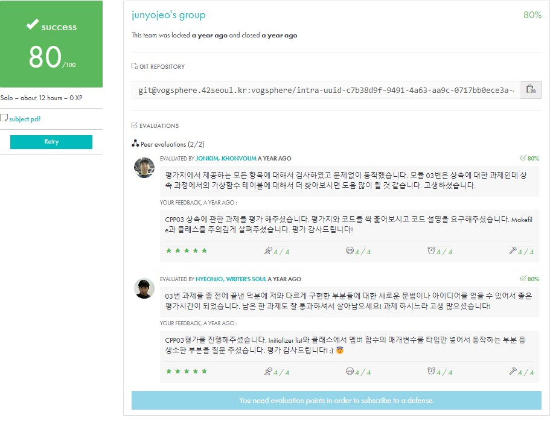
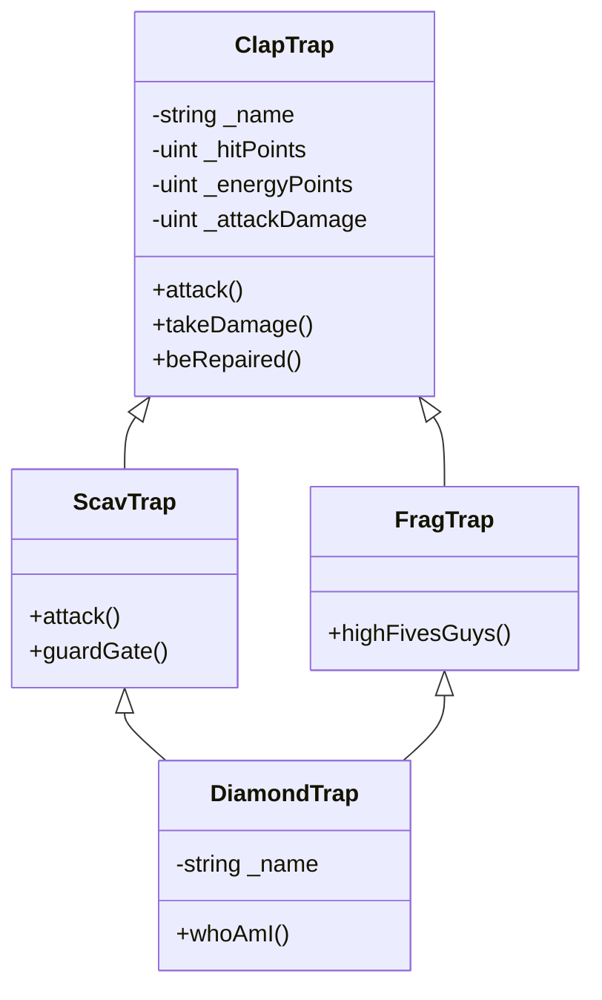

# CPP Module 03

<div align="center">
  
  
  [](https://github.com/your-username/CPP-Module-03)
</div>

## Table of Contents
- [About](#about)
- [Requirements](#requirements)
- [Implementation](#implementation)
  - [ex00: Aaaaand... OPEN!](#ex00-aaaaand-open)
  - [ex01: Serena, my love!](#ex01-serena-my-love)
  - [ex02: Repetitive work](#ex02-repetitive-work)
  - [ex03: Now it's weird!](#ex03-now-its-weird)
- [Usage](#usage)
- [Testing & Debug](#testing--debug)
- [Visual Guide & Examples](#visual-guide--examples)
- [Additional Information](#additional-information)
  - [Inheritance](#inheritance)
  - [Virtual Functions](#virtual-functions)
  - [Diamond Problem](#diamond-problem)
- [Reference](#reference)

### 🗣️ About
C++의 상속(Inheritance)을 학습하는 네 번째 C++ 모듈입니다.

• 학습 목표
  - 클래스 상속의 이해와 구현
  - 가상 함수의 활용
  - 다중 상속과 다이아몬드 문제 해결
  - 접근 제어자의 이해

• 주요 개념
  - Inheritance
    - 단일 상속
    - 다중 상속
    - 상속 접근 지정자
    - 생성자/소멸자 순서
  
  - Virtual Functions
    - 가상 함수
    - 순수 가상 함수
    - 가상 소멸자
    - 동적 바인딩
  
  - Diamond Problem
    - 다중 상속의 문제점
    - virtual 상속
    - 해결 방법

### Requirements
• 컴파일러
  - c++ (clang++)
  - -Wall -Wextra -Werror
  - -std=c++98

• 금지 사항
  - STL 사용 금지
  - <string.h> 대신 <string> 사용
  - printf 대신 cout 사용
  - 전역 변수 사용 금지

• 준수 사항
  - Orthodox Canonical Form 필수
  - 모든 클래스 헤더 파일 필요
  - 모든 멤버 함수 구현 필요
  - 가상 소멸자 사용

### Implementation

#### ex00: Aaaaand... OPEN!
• 요구사항
  - ClapTrap 클래스 구현
  - 기본적인 게임 캐릭터 속성과 행동 구현
  - Orthodox Canonical Form 준수

• 클래스 구조
```cpp
class ClapTrap {
private:
    std::string     _name;
    unsigned int    _hitPoints;
    unsigned int    _energyPoints;
    unsigned int    _attackDamage;

public:
    // Orthodox Canonical Form
    ClapTrap();
    ClapTrap(const std::string& name);
    ClapTrap(const ClapTrap& src);
    ClapTrap& operator=(const ClapTrap& rhs);
    ~ClapTrap();

    // Member functions
    void attack(const std::string& target);
    void takeDamage(unsigned int amount);
    void beRepaired(unsigned int amount);

    // Getters
    std::string getName() const;
    unsigned int getHitPoints() const;
    unsigned int getEnergyPoints() const;
    unsigned int getAttackDamage() const;
};
```

• 구현 예시
```cpp
// 생성자
ClapTrap::ClapTrap(const std::string& name)
    : _name(name), _hitPoints(10), _energyPoints(10), _attackDamage(0) {
    std::cout << "ClapTrap " << _name << " is created!" << std::endl;
}

// 공격 함수
void ClapTrap::attack(const std::string& target) {
    if (_energyPoints == 0 || _hitPoints == 0) {
        std::cout << "ClapTrap " << _name << " can't attack!" << std::endl;
        return;
    }
    
    _energyPoints--;
    std::cout << "ClapTrap " << _name << " attacks " << target 
              << ", causing " << _attackDamage << " points of damage!" 
              << std::endl;
}

// 데미지 처리 함수
void ClapTrap::takeDamage(unsigned int amount) {
    if (_hitPoints <= amount) {
        _hitPoints = 0;
    } else {
        _hitPoints -= amount;
    }
    
    std::cout << "ClapTrap " << _name << " takes " << amount 
              << " damage! HP: " << _hitPoints << std::endl;
}

// 수리 함수
void ClapTrap::beRepaired(unsigned int amount) {
    if (_energyPoints == 0 || _hitPoints == 0) {
        std::cout << "ClapTrap " << _name << " can't be repaired!" << std::endl;
        return;
    }
    
    _energyPoints--;
    _hitPoints += amount;
    
    std::cout << "ClapTrap " << _name << " is repaired by " << amount 
              << " points! HP: " << _hitPoints << std::endl;
}
```

• 학습 포인트
  - 기본 클래스 설계
  - 멤버 변수 접근 제어
  - 멤버 함수 구현
  - 상태 관리와 유효성 검사

#### ex01: Serena, my love!
• 요구사항
  - ScavTrap 클래스 구현 (ClapTrap 상속)
  - 새로운 멤버 함수 추가
  - 기존 함수 오버라이딩

• 클래스 구조
```cpp
class ScavTrap : public ClapTrap {
public:
    // Orthodox Canonical Form
    ScavTrap();
    ScavTrap(const std::string& name);
    ScavTrap(const ScavTrap& src);
    ScavTrap& operator=(const ScavTrap& rhs);
    ~ScavTrap();

    // Member functions
    void attack(const std::string& target);  // 오버라이딩
    void guardGate();                        // 새로운 기능
};
```

• 구현 예시
```cpp
// 생성자
ScavTrap::ScavTrap(const std::string& name) : ClapTrap(name) {
    _hitPoints = 100;
    _energyPoints = 50;
    _attackDamage = 20;
    std::cout << "ScavTrap " << _name << " is created!" << std::endl;
}

// 소멸자
ScavTrap::~ScavTrap() {
    std::cout << "ScavTrap " << _name << " is destroyed!" << std::endl;
}

// 오버라이딩된 공격 함수
void ScavTrap::attack(const std::string& target) {
    if (_energyPoints == 0 || _hitPoints == 0) {
        std::cout << "ScavTrap " << _name << " can't attack!" << std::endl;
        return;
    }
    
    _energyPoints--;
    std::cout << "ScavTrap " << _name << " attacks " << target 
              << ", causing " << _attackDamage << " points of damage!" 
              << std::endl;
}

// 새로운 기능
void ScavTrap::guardGate() {
    std::cout << "ScavTrap " << _name 
              << " is now in Gate keeper mode" << std::endl;
}
```

• 상속 관계 설명
```cpp
// 1. 생성자 호출 순서
ClapTrap::ClapTrap(name)  // 1. 부모 클래스 생성자
ScavTrap::ScavTrap(name)  // 2. 자식 클래스 생성자

// 2. 소멸자 호출 순서
ScavTrap::~ScavTrap()     // 1. 자식 클래스 소멸자
ClapTrap::~ClapTrap()     // 2. 부모 클래스 소멸자

// 3. 멤버 변수 접근
class ScavTrap : public ClapTrap {
    // protected로 선언된 부모 멤버 직접 접근 가능
    void someFunction() {
        this->_hitPoints = 100;    // OK
        this->_name = "ScavTrap";  // OK
    }
};
```

• 학습 포인트
  - 상속의 기본 문법
  - 생성자/소멸자 호출 순서
  - 멤버 함수 오버라이딩
  - protected 접근 지정자의 활용
  - 부모 클래스 멤버 접근 방법

#### ex02: Repetitive work
• 요구사항
  - FragTrap 클래스 구현 (ClapTrap 상속)
  - 새로운 특성과 기능 추가
  - Orthodox Canonical Form 준수

• 클래스 구조
```cpp
class FragTrap : public ClapTrap {
public:
    // Orthodox Canonical Form
    FragTrap();
    FragTrap(const std::string& name);
    FragTrap(const FragTrap& src);
    FragTrap& operator=(const FragTrap& rhs);
    ~FragTrap();

    // Member functions
    void highFivesGuys(void);     // 새로운 기능
};
```

• 구현 예시
```cpp
// 생성자
FragTrap::FragTrap(const std::string& name) : ClapTrap(name) {
    _hitPoints = 100;
    _energyPoints = 100;
    _attackDamage = 30;
    std::cout << "FragTrap " << _name << " is created!" << std::endl;
}

// 복사 생성자
FragTrap::FragTrap(const FragTrap& src) : ClapTrap(src) {
    std::cout << "FragTrap copy constructor called" << std::endl;
    *this = src;
}

// 대입 연산자
FragTrap& FragTrap::operator=(const FragTrap& rhs) {
    std::cout << "FragTrap assignation operator called" << std::endl;
    if (this != &rhs) {
        ClapTrap::operator=(rhs);  // 부모 클래스의 대입 연산자 호출
    }
    return *this;
}

// 소멸자
FragTrap::~FragTrap() {
    std::cout << "FragTrap " << _name << " is destroyed!" << std::endl;
}

// 새로운 기능
void FragTrap::highFivesGuys(void) {
    std::cout << "FragTrap " << _name 
              << " requests a positive high fives!" << std::endl;
}
```

• 클래스 비교
```cpp
// ClapTrap (부모)
HP: 10
EP: 10
AD: 0

// ScavTrap (자식1)
HP: 100
EP: 50
AD: 20
+ guardGate()

// FragTrap (자식2)
HP: 100
EP: 100
AD: 30
+ highFivesGuys()
```

• 테스트 예시
```cpp
int main() {
    FragTrap frag("FR4G");
    
    frag.attack("enemy");
    frag.takeDamage(50);
    frag.beRepaired(30);
    frag.highFivesGuys();
    
    // 복사 테스트
    FragTrap frag2(frag);
    FragTrap frag3;
    frag3 = frag;
    
    return 0;
}
```

• 학습 포인트
  - 상속을 통한 코드 재사용
  - 부모 클래스 멤버 초기화
  - 복사와 대입시 상속 관계 처리
  - 서로 다른 자식 클래스들의 특성 비교

#### ex03: Now it's weird!
• 요구사항
  - DiamondTrap 클래스 구현 (FragTrap과 ScavTrap 다중 상속)
  - 다이아몬드 문제 해결
  - 이름 충돌 처리

• 클래스 구조
```cpp
class DiamondTrap : public ScavTrap, public FragTrap {
private:
    std::string _name;  // DiamondTrap의 이름

public:
    // Orthodox Canonical Form
    DiamondTrap();
    DiamondTrap(const std::string& name);
    DiamondTrap(const DiamondTrap& src);
    DiamondTrap& operator=(const DiamondTrap& rhs);
    ~DiamondTrap();

    // Member functions
    void whoAmI();      // 자신의 이름과 ClapTrap 이름 출력
    using ScavTrap::attack;  // ScavTrap의 attack 함수 사용
};
```

• 다이아몬드 상속 구조
```cpp
        ClapTrap
       /        \
ScavTrap      FragTrap
       \        /
      DiamondTrap
```

• 구현 예시
```cpp
// 생성자
DiamondTrap::DiamondTrap(const std::string& name) 
    : ClapTrap(name + "_clap_name")
    , ScavTrap(name)
    , FragTrap(name)
    , _name(name) {
    
    _hitPoints = FragTrap::_hitPoints;        // 100
    _energyPoints = ScavTrap::_energyPoints;  // 50
    _attackDamage = FragTrap::_attackDamage;  // 30
    
    std::cout << "DiamondTrap " << _name << " is created!" << std::endl;
}

// 복사 생성자
DiamondTrap::DiamondTrap(const DiamondTrap& src)
    : ClapTrap(src)
    , ScavTrap(src)
    , FragTrap(src)
    , _name(src._name) {
    std::cout << "DiamondTrap copy constructor called" << std::endl;
}

// 대입 연산자
DiamondTrap& DiamondTrap::operator=(const DiamondTrap& rhs) {
    if (this != &rhs) {
        ClapTrap::operator=(rhs);
        _name = rhs._name;
    }
    return *this;
}

// whoAmI 함수
void DiamondTrap::whoAmI() {
    std::cout << "I am DiamondTrap " << _name 
              << ", also known as ClapTrap " 
              << ClapTrap::_name << std::endl;
}
```

• 특성 상속
```cpp
DiamondTrap 특성:
- HP: FragTrap의 HP (100)
- EP: ScavTrap의 EP (50)
- AD: FragTrap의 AD (30)
- attack(): ScavTrap의 attack() 사용
- 추가로 guardGate()와 highFivesGuys() 모두 사용 가능
```

• 다이아몬드 문제 해결
```cpp
// 1. 가상 상속 사용
class ScavTrap : virtual public ClapTrap { ... };
class FragTrap : virtual public ClapTrap { ... };

// 2. 모호성 해결
void someFunction() {
    ScavTrap::attack();  // 명시적으로 ScavTrap의 attack 사용
    ClapTrap::_name;     // 명시적으로 ClapTrap의 _name 접근
}
```

• 학습 포인트
  - 다중 상속의 개념
  - 다이아몬드 문제와 해결 방법
  - 가상 상속의 필요성
  - 이름 충돌 해결
  - 멤버 함수와 변수의 모호성 처리

### Testing & Debug

• 컴파일 및 기본 테스트
```bash
# 컴파일
make                # 전체 컴파일
make ex00          # ClapTrap
make ex01          # ScavTrap
make ex02          # FragTrap
make ex03          # DiamondTrap

# 메모리 테스트
valgrind --leak-check=full ./trap
```

• Exercise별 테스트 케이스
```cpp
// ex00: ClapTrap 테스트
int main() {
    ClapTrap clap("CP01");
    
    // 기본 기능 테스트
    clap.attack("enemy");          // EP: 10 -> 9
    clap.takeDamage(5);           // HP: 10 -> 5
    clap.beRepaired(3);           // HP: 5 -> 8, EP: 9 -> 8
    
    // 에너지 소진 테스트
    for (int i = 0; i < 8; i++)
        clap.attack("enemy");      // EP가 0이 되면 동작 불가
    
    // HP 소진 테스트
    clap.takeDamage(10);          // HP가 0이 되면 동작 불가
    clap.attack("enemy");         // 불가능
    clap.beRepaired(5);          // 불가능
}

// ex01: ScavTrap 테스트
int main() {
    ScavTrap scav("SC01");
    ClapTrap* ptr = &scav;        // 다형성 테스트
    
    scav.attack("enemy");         // ScavTrap의 attack 호출
    ptr->attack("enemy");         // ScavTrap의 attack 호출
    
    scav.guardGate();            // ScavTrap 고유 기능
    scav.takeDamage(30);         // 상속받은 기능
    scav.beRepaired(20);         // 상속받은 기능
}

// ex02: FragTrap 테스트
int main() {
    FragTrap frag("FR01");
    
    frag.attack("enemy");
    frag.highFivesGuys();
    
    // 내구도 테스트
    for (int i = 0; i < 5; i++) {
        frag.takeDamage(20);
        frag.beRepaired(10);
    }
}

// ex03: DiamondTrap 테스트
int main() {
    DiamondTrap diamond("DM01");
    
    // 기본 기능 테스트
    diamond.whoAmI();
    diamond.attack("enemy");      // ScavTrap의 attack
    diamond.guardGate();          // ScavTrap의 기능
    diamond.highFivesGuys();      // FragTrap의 기능
    
    // 상태 테스트
    std::cout << "HP: " << diamond.getHitPoints() << std::endl;      // 100
    std::cout << "EP: " << diamond.getEnergyPoints() << std::endl;   // 50
    std::cout << "AD: " << diamond.getAttackDamage() << std::endl;   // 30
    
    // 복사 테스트
    DiamondTrap diamond2(diamond);
    DiamondTrap diamond3;
    diamond3 = diamond;
}
```

• 자주 발생하는 문제와 해결
```cpp
// 1. 다이아몬드 문제
class DiamondTrap : public ScavTrap, public FragTrap {
    // 잘못된 방법
    void someFunction() {
        _name = "test";  // 모호한 참조
    }
    
    // 올바른 방법
    void someFunction() {
        ClapTrap::_name = "test";  // 명시적 지정
    }
};

// 2. 생성자 순서
DiamondTrap::DiamondTrap(std::string name)
    : ClapTrap(name + "_clap_name")  // 1. 가장 먼저
    , ScavTrap(name)                 // 2. 그 다음
    , FragTrap(name)                 // 3. 그 다음
    , _name(name) {                  // 4. 마지막
}

// 3. 가상 상속 누락
class ScavTrap : public ClapTrap {};         // 문제 발생
class ScavTrap : virtual public ClapTrap {}; // 올바른 방법
```

• 디버깅 체크리스트
```text
1. 생성자/소멸자 호출 순서 확인
   - ClapTrap -> ScavTrap/FragTrap -> DiamondTrap

2. 멤버 변수 초기화 확인
   - HP, EP, AD 값이 올바른지
   - 이름이 올바르게 설정되었는지

3. 가상 상속 확인
   - virtual 키워드가 있는지
   - 다이아몬드 문제가 발생하지 않는지

4. 메모리 누수 확인
   - valgrind로 검사
   - 소멸자 호출 확인

5. 함수 오버라이딩 확인
   - attack() 함수가 올바른 버전으로 호출되는지
   - using 선언이 필요한 곳에 되어있는지
```

### Visual Guide & Examples

• 전체 클래스 구조


• 다이아몬드 상속의 메모리 레이아웃
```text
일반 상속의 경우:
+------------------+
| ClapTrap(from B) |  <- 첫 번째 ClapTrap 인스턴스
+------------------+
| ClapTrap(from C) |  <- 두 번째 ClapTrap 인스턴스
+------------------+
| B's members      |
+------------------+
| C's members      |
+------------------+
| D's members      |
+------------------+

가상 상속의 경우:
+------------------+
| vptr(B)          |  <- 가상 테이블 포인터
+------------------+
| vptr(C)          |  <- 가상 테이블 포인터
+------------------+
| ClapTrap         |  <- 공유되는 단일 인스턴스
+------------------+
| B's members      |
+------------------+
| C's members      |
+------------------+
| D's members      |
+------------------+
```

• 게임 시나리오 예시
```cpp
int main() {
    // 전투 시나리오
    ScavTrap guard("Guard");
    FragTrap attacker("Attacker");
    DiamondTrap hero("Hero");
    
    std::cout << "\n=== Round 1: Guard Duty ===\n";
    guard.guardGate();
    attacker.attack("Guard");
    guard.takeDamage(30);
    guard.beRepaired(15);
    
    std::cout << "\n=== Round 2: Team Spirit ===\n";
    attacker.highFivesGuys();
    hero.whoAmI();
    hero.attack("Enemy");
    
    std::cout << "\n=== Round 3: Final Stand ===\n";
    // 에너지 소진까지 반복 공격
    for (int i = 0; i < 6; i++) {
        hero.attack("Enemy");
        hero.beRepaired(10);
    }
    
    return 0;
}

/* 예상 출력
=== Round 1: Guard Duty ===
ScavTrap Guard is now in Gate keeper mode
FragTrap Attacker attacks Guard, causing 30 points of damage!
ScavTrap Guard takes 30 damage! HP: 70
ScavTrap Guard is repaired by 15 points! HP: 85

=== Round 2: Team Spirit ===
FragTrap Attacker requests a positive high fives!
I am DiamondTrap Hero, also known as ClapTrap Hero_clap_name
DiamondTrap Hero attacks Enemy, causing 30 points of damage!

=== Round 3: Final Stand ===
DiamondTrap Hero attacks Enemy, causing 30 points of damage!
DiamondTrap Hero is repaired by 10 points! HP: 110
...
DiamondTrap Hero can't attack! No energy points left!
*/
```

### Additional Information

#### Inheritance
• 상속의 종류
```cpp
// 1. public 상속
class Derived : public Base {
    // public -> public
    // protected -> protected
    // private -> 접근 불가
};

// 2. protected 상속
class Derived : protected Base {
    // public -> protected
    // protected -> protected
    // private -> 접근 불가
};

// 3. private 상속
class Derived : private Base {
    // public -> private
    // protected -> private
    // private -> 접근 불가
};
```

• 생성자/소멸자 순서
```cpp
// 생성 순서
Base::Base()        // 1. 부모 생성자
Derived::Derived()  // 2. 자식 생성자

// 소멸 순서
Derived::~Derived() // 1. 자식 소멸자
Base::~Base()       // 2. 부모 소멸자

// 다중 상속의 경우
GrandParent::GrandParent()  // 1. 조부모
Parent1::Parent1()          // 2. 첫 번째 부모
Parent2::Parent2()          // 3. 두 번째 부모
Child::Child()             // 4. 자식
```

#### Virtual Functions
• 가상 함수의 동작
```cpp
class Base {
public:
    virtual void foo() { }     // 가상 함수
    void bar() { }            // 비가상 함수
};

class Derived : public Base {
public:
    void foo() override { }    // 오버라이딩
    void bar() { }            // 하이딩
};

Base* ptr = new Derived();
ptr->foo();    // Derived::foo() 호출
ptr->bar();    // Base::bar() 호출
```

• 가상 소멸자
```cpp
class Base {
public:
    virtual ~Base() { }  // 가상 소멸자
};

class Derived : public Base {
    char* ptr;
public:
    Derived() : ptr(new char[10]) { }
    ~Derived() { delete[] ptr; }  // 적절한 정리
};

Base* ptr = new Derived();
delete ptr;  // Derived의 소멸자가 호출됨
```

#### Diamond Problem
• 문제 발생 구조
```cpp
    A
   / \
  B   C
   \ /
    D
```

• 해결 방법
```cpp
// 1. 가상 상속
class B : virtual public A { };
class C : virtual public A { };
class D : public B, public C { };

// 2. 범위 지정
class D : public B, public C {
    void foo() {
        B::someFunction();     // B의 함수 명시
        C::someFunction();     // C의 함수 명시
        A::someVariable = 10;  // A의 변수 명시
    }
};

// 3. using 선언
class D : public B, public C {
    using B::someFunction;  // B의 함수 사용
    using C::someVariable;  // C의 변수 사용
};
```

• 가상 상속의 특징
```cpp
// 1. 생성자 호출
D::D() : A(), B(), C() {  // 가상 기본 클래스는 직접 초기화
}

// 2. 메모리 구조
Virtual Base Table  // 가상 기본 클래스 접근을 위한 테이블
Object Layout      // 단일 A 인스턴스 공유

// 3. 성능 고려사항
- 추가적인 메모리 사용
- 간접 접근으로 인한 성능 저하
- 컴파일러 최적화 제한
```

### Reference
> 상속, 가상 함수, 다이아몬드 문제에 대한 심화 자료

• C++ Inheritance
  - [C++ Inheritance Documentation](https://en.cppreference.com/w/cpp/language/inheritance)
    - 상속의 기본 개념
    - 접근 지정자
    - 상속 종류
  
  - [Microsoft: Inheritance in C++](https://learn.microsoft.com/cpp/cpp/inheritance-cpp)
    - 상속 구현 가이드
    - 모범 사례
    - 주의사항

• Virtual Functions
  - [Virtual Functions in C++](https://isocpp.org/wiki/faq/virtual-functions)
    - 가상 함수의 작동 원리
    - vtable 구조
    - 성능 고려사항
  
  - [Virtual Destructors](https://www.geeksforgeeks.org/virtual-destructor/)
    - 가상 소멸자의 필요성
    - 메모리 누수 방지
    - 구현 패턴

• Diamond Problem
  - [Multiple Inheritance in C++](https://www.cprogramming.com/tutorial/multiple_inheritance.html)
    - 다중 상속의 개념
    - 문제점과 해결책
    - 실제 사용 사례
  
  - [Virtual Inheritance](https://en.wikipedia.org/wiki/Virtual_inheritance)
    - 가상 상속의 메커니즘
    - 메모리 레이아웃
    - 성능 영향

• 추천 도서
  - "Effective C++" by Scott Meyers
    - Item 7: Declare destructors virtual in polymorphic base classes
    - Item 39: Use private inheritance judiciously
    - Item 40: Use multiple inheritance judiciously
  
  - "C++ Programming Language" by Bjarne Stroustrup
    - Chapter 20: Derived Classes
    - Chapter 21: Class Hierarchies
    - Chapter 24: Virtual Functions

• 유용한 도구
  - [C++ Insights](https://cppinsights.io/)
    - 가상 함수 테이블 확인
    - 상속 구조 분석
  
  - [Compiler Explorer](https://godbolt.org/)
    - 생성된 어셈블리 코드 확인
    - 최적화 결과 분석

• 추가 학습 자료
  - [RAII and Rule of Three/Five](https://en.cppreference.com/w/cpp/language/rule_of_three)
    - 리소스 관리
    - 복사/이동 의미